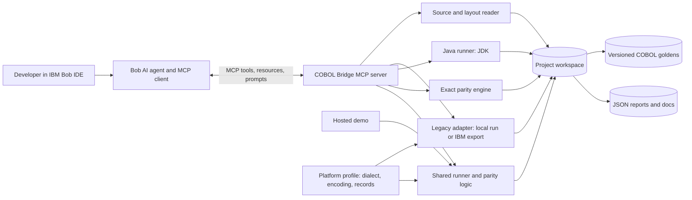
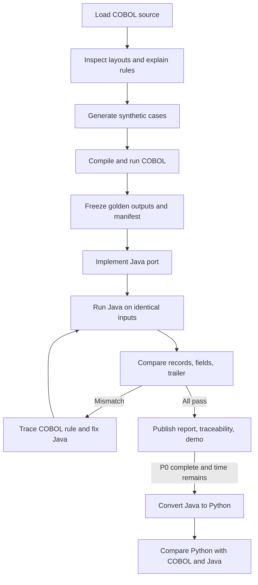

# COBOL Bridge architecture and implementation guide

**Purpose:** Build a working Model Context Protocol (MCP) project that helps a developer understand one COBOL batch program, convert it to **Java**, and prove that the Java output matches the COBOL output. If the Java path is complete and time remains, add a **Java → Python** conversion workflow.

**Primary user:** A developer or QA engineer modernizing a legacy batch process.

**One-sentence outcome:** Given a sample COBOL program and synthetic inputs, an MCP-connected AI agent explains the program, captures its behavior, creates a Java port, and returns an exact field-level parity report.

> This document records design goals and implementation priorities. The
> [README](../README.md) describes the current supported workflows and results.

## 1. Priority and scope

| Priority | Deliverable | Completion test |
|---|---|---|
| **P0 — required** | One compilable `LOANCALC` COBOL batch program and synthetic fixed-width data | COBOL runs locally and creates reproducible outputs |
| **P0 — required** | Platform profile and legacy-fixture import path | The same parity engine accepts a local golden or an IBM-exported golden with declared record and encoding metadata |
| **P0 — required** | MCP server exposing analysis, legacy execution, Java execution, and parity tools | An MCP client can discover and call the tools |
| **P0 — required** | Plain-language explanation, record layouts, business rules, and traceability | A reviewer can trace each rule from COBOL to Java and a test |
| **P0 — required** | Faithful **COBOL → Java** conversion | Java produces exact matching data records and trailer on all committed datasets |
| **P0 — required** | Field-level parity report and repeatable tests | Report names each mismatch and exits/fails on any difference |
| **P0 — required for hackathon submission** | Working hosted demonstration, README, IBM Bob task-session screenshots, and measured before/after evidence | A judge can run the demonstrated scenario from a fresh browser session |
| **P1 — after P0 is green** | Java → Python conversion workflow | Python matches both the COBOL goldens and Java output on the same cases |
| **P2 — only if time remains** | File upload, live COBOL on the hosted demo, diagrams, watsonx Q&A, more programs | Each added feature has a working demo and an honest limitation statement |

**Do not start P1 while any P0 parity mismatch, missing golden, broken MCP call, or inaccessible demo remains.** Java is the primary migration target. The sample program and rules below are a starting contract, to be finalized against the compiled COBOL implementation.

### Deliberate limits

- One self-contained batch program. No live CICS, JCL, Db2, VSAM, mainframe connection, real customer data, or general-purpose COBOL transpiler in the prototype. Preserve clear adapters for future IBM connections.
- MCP supplies bounded project tools and context. The **AI agent in the MCP host** interprets the source and writes conversion code. Do not describe a deterministic MCP tool as an autonomous translator unless it actually invokes a model and produces working code.
- IBM Bob 2.0 is used in the **build workflow** and evidenced with its task summaries. Do not claim Bob runs inside the finished application unless an actual runtime integration is built and verified.

## 2. Architecture



### Layer responsibilities

| Layer | Responsibility | Design choice |
|---|---|---|
| IBM Bob host + AI agent | Decide the sequence, read context, document rules, write and debug Java | Bob IDE connects to the project's local MCP server; agent instructions in this file |
| MCP server | Expose safe, typed operations and project context | Python MCP SDK, local `stdio` first; pin a tested SDK release |
| Core library | Parse records, run bounded subprocesses, compare output, generate reports | Pure Python modules shared by MCP server, CLI, tests, and demo |
| Legacy adapter | Obtain source, inputs, and observed output without changing parity logic | GnuCOBOL local runner first; IBM-exported fixture importer in P0 |
| Modern runner | Compile and run the Java port | JDK 17+; use `BigDecimal` for decimal arithmetic; keep dependencies portable enough to test on IBM Semeru Runtime 17 when available |
| Golden store | Preserve observed COBOL behavior | Versioned input/output pairs plus hashes and toolchain metadata |
| Demo | Show explanation and rerun Java parity against committed goldens | Streamlit or equivalent; deploy with a Java runtime |

The hosted demo can run Java live against **committed** COBOL outputs, so it does not need a COBOL compiler. A Docker host with a JDK is the straightforward deployment path. Keep the MCP server usable locally even if remote MCP hosting is never added. The app should call the shared core library rather than copy parity logic. Deploying on IBM infrastructure later should change the adapter and deployment configuration, not the Java rules or parity engine. The same container image can be considered for [IBM Cloud Code Engine](https://cloud.ibm.com/docs/codeengine?topic=codeengine-getting-started) or [Red Hat OpenShift on IBM Cloud](https://cloud.ibm.com/docs/openshift?topic=openshift-getting-started) if the team has access; neither platform is required to prove the P0 workflow.

### Connect the server to IBM Bob

IBM Bob documents project-level MCP configuration in `.bob/mcp.json` with an `mcpServers` object and local `stdio` transport. Configure the Python server there using the actual interpreter path and project directory, with no credentials in the file. In Bob's MCP settings, enable the server and verify that Bob can list and call `inspect_cobol`, `capture_golden`, `run_java`, and `compare_parity`. Keep destructive or environment-changing tools subject to Bob's normal approval flow. See [Using MCP in Bob](https://bob.ibm.com/docs/ide/configuration/mcp/mcp-in-bob) and [MCP transports](https://bob.ibm.com/docs/ide/configuration/mcp/server-transports).

This connection is part of the prototype's value: Bob should **use the finished MCP tools** to carry out a real modernization run, as well as help build them. Capture one Bob task summary showing a tool call and its parity result. If Bob's installed version cannot connect, record the issue and use a separate MCP client for protocol verification; do not claim Bob used the server in that case.

### IBM compatibility profile and adapters

Make IBM compatibility a **data and execution boundary**, not an IBM-specific rewrite of the whole app. The first demo uses GnuCOBOL, but the same MCP tools and Java port should accept a fixture exported from an IBM environment. GnuCOBOL parity proves behavior for the local sample only; call a result *IBM-verified* only after comparing with output produced by the target IBM runtime.

| Adapter/profile | What it does | Build priority |
|---|---|---|
| `local_gnucobol` | Compile and run the synthetic sample; create the demo goldens | P0 |
| `imported_legacy_fixture` | Import authorized synthetic source, copybooks, input records, output records, and run metadata from IBM z/OS or IBM i; perform no remote execution | P0 |
| `zos_batch` | With site approval, obtain datasets, submit a controlled JCL job, and retrieve output through the site's approved z/OS tooling such as Zowe | Later; never needed for the public demo |
| `zos_connect_api` | Call a pre-existing, authorized z/OS Connect API if the legacy function is exposed as a service | Later; relevant to online/service workloads, not this batch sample |
| `ibm_i_export` | Import an IBM i source member and exported record files with their CCSID metadata | Later live connector; P0 import format already supports its fixtures |

Use one versioned **platform profile** per source system. It must declare `system` (`local`, `zos`, or `ibmi`), COBOL dialect/compiler and options, source/copybook references, character encoding or CCSID, record format, logical record length, input/output layouts, and golden origin. Reject an import when required metadata is missing. Keep raw source and record bytes alongside decoded views; never assume a text file's newline or UTF-8 encoding describes an IBM dataset. z/OS datasets may use record formats such as FB or VB rather than newline-delimited files, and IBM COBOL can use packed decimal (`COMP-3`). The first sample uses display numeric fields; packed decimal parsing is a later adapter capability and must not be silently treated as text. See [IBM z/OS record formats](https://www.ibm.com/docs/en/zos-basic-skills?topic=set-data-record-formats), [Enterprise COBOL numeric storage](https://www.ibm.com/docs/en/SS6SG3_6.4.0/pdf/pgmvs.pdf), and [IBM i CCSID guidance](https://www.ibm.com/docs/en/i/7.4.0?topic=conversions-ccsid-code-page-tagging-i-files).

Parity compares **exact decoded field values, widths, padding, order, and trailer** under the declared profile. Compare raw bytes too when both sides use the same encoding and record format. Do not report a false mismatch merely because IBM EBCDIC bytes differ from Java UTF-8 bytes; do not trim spaces or relax numeric equality during decoding. IBM documents EBCDIC/code-page handling in [Enterprise COBOL `CODEPAGE`](https://www.ibm.com/docs/en/cobol-zos/6.3.0?topic=options-codepage). Zowe supports z/OS dataset and job operations through its [CLI](https://docs.zowe.org/stable/appendix/zowe-cli-command-reference/); [IBM z/OS Connect](https://www.ibm.com/docs/en/zos-connect/3.0.0?topic=connect-what-are-zos-api-providers) is an option when an authorized API already exists. These are integration paths, not features claimed for the P0 demo.

Official MCP SDK documentation describes server tools, resources, prompts, local `stdio`, and testing through an in-memory client: [Python SDK](https://py.sdk.modelcontextprotocol.io/), [client and testing guide](https://py.sdk.modelcontextprotocol.io/get-started/). Check the pinned SDK version's API before coding; do not paste unverified examples from another release.

### MCP surface (MVP)

Use a small, explicit interface. Return structured JSON with `status`, `dataset_id`, `artifact_paths`, and `errors` where relevant. Keep diagnostic logs on stderr; stdout belongs to MCP when using `stdio`.

| Type | Name | Input | Result / behavior |
|---|---|---|---|
| Tool | `inspect_cobol` | Workspace-relative source path | Source hash, paragraphs, candidate input/output fields, unresolved questions. Label heuristic findings as such. |
| Tool | `generate_test_inputs` | Approved dataset profile and seed | Synthetic fixed-width records and a manifest; never use personal data. |
| Tool | `capture_golden` | Dataset ID and local profile ID | Compile/run local COBOL, save output and metadata. Refuse to overwrite an existing frozen golden by default. |
| Tool | `import_golden` | Dataset ID, IBM profile ID, workspace paths to authorized synthetic exported input/output | Validate profile and hashes; register an external COBOL golden without running on IBM systems. |
| Tool | `run_java` | Dataset ID | Compile/run Java on exactly the same input; save stdout/output and errors. |
| Tool | `compare_parity` | Dataset ID and candidate (`java`) | Exact record, field, and trailer comparison; machine-readable report and summary. |
| Tool | `get_run_report` | Run ID | Read a prior report without rerunning anything. |
| Resource | `cobolbridge://spec` | — | Current layouts, rules, and limitations. |
| Resource | `cobolbridge://datasets/{id}` | Dataset ID | Manifest and sample case descriptions, excluding large raw dumps. |
| Prompt | `modernize_cobol_to_java` | Source and dataset IDs | Agent checklist: explain → characterize → port → verify → report. |

For **P1**, add a `modernize_java_to_python` prompt plus `run_python` and Python parity support. The agent writes Python code; the MCP tools execute and verify it. The final truth for Python remains the COBOL golden, with Java comparison providing an extra regression check.

### Tool safety and repeatability

- Restrict every file argument to an allowlisted project root; reject absolute paths, path traversal, and symlink escapes.
- Never pass caller strings to a shell. Invoke fixed compiler/runtime binaries with argument arrays, timeouts, limited output sizes, and separate working directories.
- Treat the COBOL file and frozen golden outputs as read-only after characterization. Changing them requires an explicit new fixture version and a documented reason.
- Do not load arbitrary uploads or execute user-supplied source in the public demo. The MVP demo uses committed sample datasets.
- Record input hash, source hash, compiler/runtime versions or externally supplied job ID, platform profile, code page, record format, run timestamp, and result hash in a manifest. A parity report must identify the exact golden and candidate versions compared.
- Return understandable errors for invalid record length, missing compiler, compile failure, timeout, missing golden, and malformed output.

## 3. Sample program and data contract

Use the planning document's `LOANCALC` example: a monthly loan-servicing batch that reads one fixed-width input record per line, calculates interest and late fee, emits an output record, and finishes with a trailer. Keep all data synthetic.

### Input layout to implement first

| Field | Columns (1-based) | Width | Example | Meaning |
|---|---:|---:|---|---|
| `CUST-ID` | 1–8 | 8 | `C0000123` | Synthetic identifier |
| `PRINCIPAL` | 9–17 | 9 | `001250000` | Implied 2 decimals = 12,500.00 |
| `ANNUAL-RATE` | 18–22 | 5 | `00725` | Implied 4 decimals = 0.0725 |
| `TERM-MONTHS` | 23–25 | 3 | `060` | Loan term |
| `DAYS-LATE` | 26–28 | 3 | `017` | Days past due |

Write the exact **output** and **trailer** layouts in `docs/record_layouts.md` once `LOANCALC` compiles. Specify field offsets, widths, status values, encoding/CCSID, record framing, and whether spaces are significant. The local sample may use newline-delimited records; an IBM profile must state its actual record format and LRECL. The planning file names the output fields but does not fully define trailer widths. Do not let the COBOL and Java implementations independently invent these details.

### Business rules to characterize

| ID | Expected rule | Critical edge |
|---|---|---|
| R1 | Monthly interest = principal × annual rate ÷ 12, stored to cents with COBOL `ROUNDED` behavior | A value exactly on a half-cent |
| R2 | If days late > 15, late fee = 5% of monthly interest, stored without `ROUNDED`, minimum 5.00 | Days 15/16 and a fee with a third decimal |
| R3 | If days late > 60, double the late fee after the minimum | Days 60/61; order of operations |
| R4 | Zero principal, zero annual rate, or invalid numeric input creates `ERR` and is excluded from totals | Non-numeric byte in a numeric field |
| R5 | Trailer counts records and errors; total due sums only successful records | Mixed OK/ERR batch |

Implement and test the actual COBOL behavior before declaring any rule final. For Java, parse implied decimals as integer digits or `BigDecimal` from strings, use explicit scale and `RoundingMode` at each assignment boundary, and never use `double` or `float` in the faithful port. `RoundingMode.HALF_UP` and `RoundingMode.DOWN` are candidate mappings for the nonnegative sample fields; verify half-cent, truncation, intermediate precision, and overflow against compiled COBOL outputs. A parity failure is evidence to investigate, not a reason to change the golden.

### Required synthetic cases

Generate roughly 40–60 records across normal, half-cent rounding, fee truncation, 15/16 and 60/61 day boundaries, minimum fee, zero principal/rate, malformed numeric field, maximum representable values, and a mixed batch that exercises the trailer. If a malformed record causes the legacy program to abort, represent that honestly as a characterized failure rather than inventing an `ERR` record in Java.

## 4. End-to-end workflow



### Agent behavior during parity debugging

1. Read the failing dataset, record number, field name, expected bytes, actual bytes, and associated rule.
2. Locate the COBOL statement and Java method responsible for that field. Check parsing, decimal scale, rounding, fee order, formatting, and accumulator handling.
3. Change **Java** to reproduce observed COBOL behavior. If the COBOL source itself is broken, document a separate source correction and regenerate goldens as a new fixture version; never silently rewrite the expected file.
4. Rerun the failing case and the full suite. Update `docs/traceability.md` and the mismatch report.
5. If parity remains incomplete, report the remaining mismatches plainly. Do not show a green result based on a reduced dataset.

## 5. Build phases and exit gates

| Phase | Work the AI agent should do | Required artifacts | Exit gate |
|---|---|---|---|
| **0. Prepare** | Confirm Bob IDE works, toolchains exist, initialize repo, pin dependencies, document architecture. Capture Bob evidence as tasks finish. | `README.md`, project config, `bob_sessions/` | Tool versions recorded; MCP server starts locally. |
| **1. Legacy baseline** | Implement one small fixed-format COBOL program, synthetic input generator, compile/run script, exact output layout. | `legacy/`, `data/inputs/`, `docs/record_layouts.md` | COBOL compiles and runs the normal and edge datasets. |
| **2. Characterize** | Capture COBOL outputs; freeze manifests; write explanation, R1–R5, and test case map. Define the platform-profile schema and a synthetic IBM-style fixture for import testing. | `data/golden/`, `profiles/`, `docs/`, fixture hashes | Every dataset has an input, golden, and manifest; the importer rejects missing encoding or record metadata. |
| **3. MCP core** | Implement tool contracts, project-root validation, local runner, external-fixture importer, errors, resource/prompt, and a CLI using the same core. Connect the local server to Bob. | `mcp_server/`, `core/`, `adapters/`, `.bob/mcp.json`, `tests/test_mcp.py` | MCP client and Bob discover the tools; local capture and profile-based import work; a missing Java candidate returns a clear error. |
| **4. Java conversion** | Implement fixed-width parser/formatter, rule functions, batch runner, and tests; use Bob to investigate parity failures. Keep to Java 17 standard APIs and test on IBM Semeru 17 if available. | `modern/java/`, `tests/`, `docs/traceability.md` | **Zero field and trailer mismatches on all frozen datasets.** |
| **5. Demo and evidence** | Build an explanation + parity demo, deploy with JDK, record a real before/after measure, finish README and Bob screenshots. | `app/`, `metrics/`, public demo, `bob_sessions/` | Fresh browser can run parity; claims match actual outputs. |
| **6. Optional Python** | Implement Java → Python conversion workflow, Python runner, cross-language reports. | `modern/python/`, extra MCP prompt/tool support | Python equals COBOL goldens and Java for every dataset; P0 still passes. |

**Delivery checkpoint:** Establish a reproducible COBOL golden before adding optional features. Reserve time to verify the demo, documentation, and evidence artifacts.

### Verification commands and checks to provide

Document actual commands in the README after implementation. Aim for one command each to generate sample data, compile/run COBOL, run Java, run parity, and run the whole test suite. The suite should cover:

- Record offsets, widths, numeric parsing, zero padding, and invalid lines.
- Rule boundaries and decimal results, especially half-cent and truncation cases.
- Exact data-record comparison, record ordering and count, and exact trailer comparison.
- MCP tool discovery, valid calls, errors, path restrictions, and frozen-golden protection.
- Profile-based import and parity using synthetic IBM-style EBCDIC/FB fixtures; verify byte preservation and exact decoded fields. This tests the adapter contract, not a live IBM system.
- A local end-to-end run using the same datasets shown in the hosted demo.

`compare_parity` must return a non-success status when any record, field, or trailer differs. A report should include `dataset_id`, hashes, counts, `trailer_match`, and mismatches such as:

```json
{
  "record_no": 17,
  "cust_id": "C0000017",
  "field": "LATE-FEE",
  "expected": "0000512",
  "actual": "0000513",
  "rule_id": "R2"
}
```

## 6. Suggested repository layout

```text
cobol-bridge-mcp/
├── README.md
├── LICENSE
├── AGENTS.md
├── .bob/
│   └── mcp.json                   # Bob project-level server config; no secrets
├── pyproject.toml                 # MCP server, core library, test dependencies
├── Dockerfile                     # demo image with Python and JDK
├── legacy/
│   ├── LOANCALC.cbl
│   └── build.sh
├── data/
│   ├── inputs/
│   ├── golden/
│   └── manifests/
├── profiles/
│   ├── schema.json
│   ├── loancalc_local.yaml
│   ├── ibm_zos.example.yaml       # site values required before real use
│   └── ibm_i.example.yaml         # site values required before real use
├── adapters/
│   ├── local_gnucobol.py
│   └── imported_fixture.py
├── core/
│   ├── records.py
│   ├── runners.py
│   └── parity.py
├── mcp_server/
│   └── server.py
├── modern/
│   ├── java/                      # P0
│   └── python/                    # P1 only
├── tools/
│   ├── generate_test_data.py
│   └── verify_all.py
├── docs/
│   ├── LOANCALC_explained.md
│   ├── record_layouts.md
│   ├── business_rules.md
│   └── traceability.md
├── tests/
├── app/
│   └── streamlit_app.py
├── metrics/
│   └── before_after.md
└── bob_sessions/                 # IBM Bob task-summary PNGs
```

Adapt paths to the actual Bob configuration format after checking its installed documentation. Do not let Bob-specific configuration become a dependency of the MCP server's runtime.

## 7. Demo, measurement, and submission

### Demo flow for a judge

1. Show the input layout and a short explanation of the COBOL rule that can cause a cent-level mismatch.
2. Select a committed synthetic dataset and run the **Java** candidate against the committed COBOL golden.
3. Show total records, exact matches, mismatches by field/rule, and trailer status. Let the judge inspect or download the JSON report.
4. Show the relevant Bob task-session screenshot and a traceability entry connecting COBOL, Java, and the test.
5. If P1 exists, select the Python candidate and show its separate parity report. Label it as an extension, not the primary result.

The demo must state whether COBOL is run live or whether committed goldens are used. Handle missing files and failures with visible error messages. Do not hardcode a green parity result.

### Impact evidence

Measure a real before/after scenario on the **same input set**. Good measures are mismatched fields in a deliberately naive Java baseline versus the faithful Java port; time or steps required to locate a seeded rounding bug; and business rules covered by tests. Keep the baseline labeled as deliberate, record the method and raw counts in `metrics/before_after.md`, and avoid extrapolating one sample to all COBOL systems.

### IBM Bob and hackathon evidence

- Use Bob for meaningful multi-step work: source explanation, test-case planning, Java port, parity debugging, and documentation. Connect Bob to this project's MCP server and show at least one real tool-assisted run. Record exactly which tasks Bob performed.
- Save each relevant Bob task-session summary as a clearly named PNG in `bob_sessions/` immediately after the task. The final guide calls the evidence folder `bob-evidence/`, while the planning file and quoted event discussion specify `bob_sessions/`; use `bob_sessions/` for this project and link it from README. Check the event form for any additional upload instruction.
- The README should include the problem, architecture, MCP tool list, setup, test commands, demo link, Bob contribution, metrics, limitations, and next steps.
- Prepare a public repository, working app URL, short demo video, pitch deck, and cover image. Check links from a private browser session and verify the submission form is marked complete.
- Use only synthetic data. Do not commit secrets. Review external dependencies and assets before publication.

## 8. Instructions to the building AI agent

1. **Work in phase order.** Finish each exit gate before starting the next phase. P0 Java parity takes precedence over visual polish and all optional work.
2. **Keep one source of truth.** The compiled COBOL program and versioned goldens define observed behavior. Document discrepancies between intended rules and observed output.
3. **Make assumptions visible.** If a record field, rounding mode, overflow rule, or invalid-input behavior is unclear, create a targeted COBOL case and record the result before implementing Java.
4. **Keep the MCP interface small.** Implement typed, testable operations backed by shared core functions. Do not put conversion reasoning in an opaque tool that cannot explain its output.
5. **Report evidence.** For every phase, provide changed files, the command/tool run, pass/fail result, remaining mismatches, platform profile, and the next gate. Label local and imported-fixture checks accurately; never claim IBM runtime verification from a simulated profile or mock response.
6. **Use remaining time wisely.** Add Java → Python only after a working Java demo, full parity, and required submission evidence exist.
